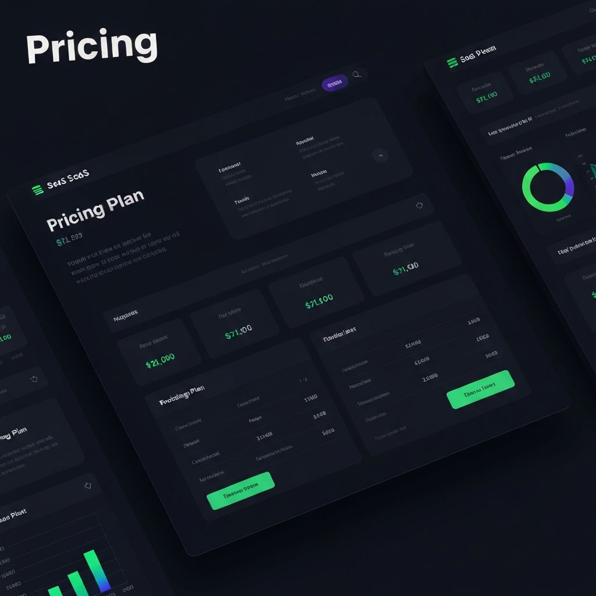

# E2B Custom Template Setup

This directory contains the custom E2B template definition for generated Next.js 15 + shadcn/ui projects. (The platform UI runs on Next.js 16.)

## Why Use a Custom Template?

**Performance Improvement**: Cold start time reduced from **~3-5 minutes to ~2-5 seconds** (60x faster!)

The custom template pre-installs:
- ✅ Next.js 15 with TypeScript and App Router
- ✅ Tailwind CSS pre-configured
- ✅ All shadcn/ui components
- ✅ Lucide React icons
- ✅ Framer Motion for animations
- ✅ All dependencies cached

## E2B Template v2 (New System)

This project has been migrated to the **E2B Template v2** system which uses SDK-based template definitions instead of the deprecated CLI v1 system.

### Prerequisites

1. **Get your E2B API Key**:
   - Visit https://e2b.dev/docs/api-key
   - Sign up/login and copy your API key

2. **Add API Key to .env.local**:
\`\`\`bash
E2B_API_KEY=e2b_***
\`\`\`

### Build the Template

From the project root, run:

**Development Build:**
\`\`\`bash
npx tsx lib/e2b/templates/build.dev.ts
\`\`\`

**Production Build:**
\`\`\`bash
npx tsx lib/e2b/templates/build.prod.ts
\`\`\`

This will:
1. Read the Dockerfile content
2. Upload and build the template in the E2B cloud
3. Assign the template an alias (e.g., `creative-lovable-nextjs`)
4. Show build logs in real-time

**Note**: Building takes ~5-10 minutes the first time. Subsequent builds are faster.

### Using the Template

After building, update the environment variable in `.env.local`:

\`\`\`env
E2B_API_KEY=e2b_***
E2B_TEMPLATE_ID=creative-lovable-nextjs
\`\`\`

The `createSandbox()` function in `lib/e2b/sandbox.ts` will automatically use this template.

## Template Files

This directory contains:
- **`nextjs-shadcn.e2b.Dockerfile`** - The Docker image definition
- **`template.ts`** - Template configuration using the E2B SDK
- **`build.dev.ts`** - Development build script
- **`build.prod.ts`** - Production build script

## Troubleshooting

### Authentication Error
If you see "Unauthorized, please check your credentials":
- Ensure `E2B_API_KEY` is set in `.env.local`
- Get your API key from https://e2b.dev/docs/api-key
- The API key should start with `e2b_`

### Build Fails
- Check that all dependencies are installed: `pnpm install`
- Verify the Dockerfile syntax is correct
- Check build logs for specific errors

### Template Not Found
- After building, use the template alias (e.g., `nextjs-shadcn-v1`) as your `E2B_TEMPLATE_ID`
- Make sure the build completed successfully

### Slow First-Time Use
- First sandbox creation may still take 10-20 seconds
- Subsequent creates should be 2-5 seconds

## Cost Considerations

- Templates are free to build and store
- You only pay for sandbox runtime (billed per second)
- Pre-built templates reduce billable runtime

## Alternative: Use Default Template

If you don't want to build a custom template, the app will fall back to the base E2B template, but will need to install dependencies on each cold start.

To use the default template, simply don't set `E2B_TEMPLATE_ID` in your environment variables.
