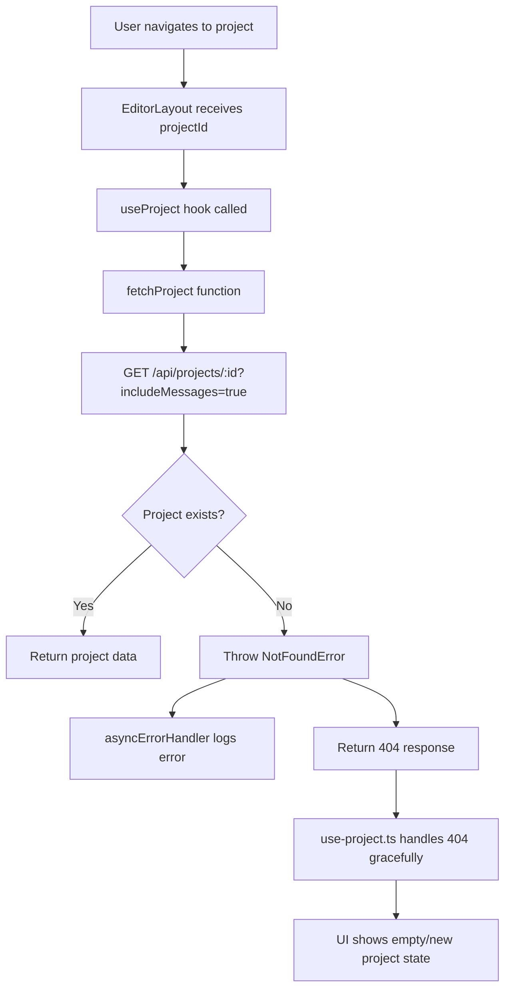

# Debug and Fix Plan

## Issue 1: Landing Page Input Button Toolbar Overflow

### Problem
The button toolbar at the bottom of the landing page input box extends beyond the container on smaller screens. The buttons overflow to the right instead of wrapping or fitting within the input box.

### Root Cause
In `components/landing/hero-section.tsx`, the toolbar container (lines 260-311) uses `flex items-center justify-between` without any wrapping or overflow handling:
```tsx
<div className="flex items-center justify-between mt-3 pt-3">
```

The left and right button groups don't have constraints to prevent overflow on narrow viewports.

### Solution
Add flex-wrap and minimum width constraints to the toolbar:
1. Add `flex-wrap` to allow buttons to wrap on smaller screens
2. Add `min-w-0` to flex children to prevent overflow
3. Consider adding `overflow-hidden` to ensure content stays contained

### Files to Modify
- `components/landing/hero-section.tsx` - Fix button toolbar layout (lines 260-311)

### Code Fix
```diff
// Line 260 - Add flex-wrap to allow wrapping
- <div className="flex items-center justify-between mt-3 pt-3">
+ <div className="flex items-center justify-between mt-3 pt-3 flex-wrap gap-2">

// Also ensure the child containers handle overflow properly
// Left side buttons container
- <div className="flex items-center gap-2">
+ <div className="flex items-center gap-2 flex-wrap min-w-0">

// Right side buttons container
- <div className="flex items-center gap-2">
+ <div className="flex items-center gap-2 flex-wrap min-w-0">
```

## Issue 2: "Project not found" 404 Error

### Problem
The application is making requests to `/api/projects/{id}?includeMessages=true` for a project ID that doesn't exist in the database (`aededcc7-7527-4615-bf2c-4ec1ad62ec1c`), resulting in 404 errors logged in the terminal.

### Root Cause Analysis
1. The error occurs in `ProjectService.getProjectWithMessages` (lib/services/project.service.ts:124-150)
2. The error is triggered from `hooks/use-project.ts` in the `fetchProject` function
3. Looking at the trace, there are duplicate requests (same timestamp) - suggests a race condition or double-fetch
4. The 404 is already handled gracefully in `use-project.ts` (lines 185-192) by silently returning for new projects
5. The error logging comes from the server's error handler logging operational errors

### Why This Happens
- When a user navigates to a project or restores a session, the app attempts to fetch project data
- If the project was deleted or the ID is stale (e.g., from browser history, localStorage, or a cached URL), the 404 occurs
- The UI handles this gracefully (shown in use-project.ts), but the server still logs the error

### Solution
1. **Server-side**: Make 404 errors for project fetching less noisy - they're expected when users navigate to deleted projects
2. **Client-side**: Add better caching/prevention of duplicate requests
3. **Alternative**: Consider redirecting to home when a project is not found instead of silently failing

### Files to Review/Modify
- `lib/services/project.service.ts` - Already throws NotFoundError correctly
- `hooks/use-project.ts` - Already handles 404 gracefully
- `app/api/projects/[id]/route.ts` - Error is logged by asyncErrorHandler

## Implementation Plan

### Step 1: Fix Input Box Overflow
```diff
// components/chat/prompt-input.tsx
className={cn(
-   "min-h-[48px] w-full resize-none bg-transparent px-1 text-[15px] leading-relaxed text-zinc-100 placeholder:text-zinc-500 focus:outline-none transition-colors",
+   "min-h-[48px] w-full resize-none bg-transparent px-1 text-[15px] leading-relaxed text-zinc-100 placeholder:text-zinc-500 focus:outline-none transition-colors overflow-wrap-break-word",
    showImproveEffect && "text-violet-300"
)}
```

Or add inline style:
```diff
style={{
    // Simple auto-resize via style
    height: textareaRef.current ? Math.min(textareaRef.current.scrollHeight, 200) + 'px' : 'auto',
+   overflowWrap: 'break-word',
+   wordBreak: 'break-word',
}}
```

### Step 2: Investigate Duplicate Requests
- Check if `useProject` hook is being called multiple times
- Check if `fetchProject` is being triggered by multiple effects

### Step 3: Consider Server-Side Logging Adjustment
The 404 errors are operational errors that the UI handles gracefully. Consider:
- Not logging 404s for project fetching as "errors" since they're expected user behavior
- Or reducing the log level for NotFoundError in project operations

## Mermaid Diagram: Data Flow for Project Fetching


